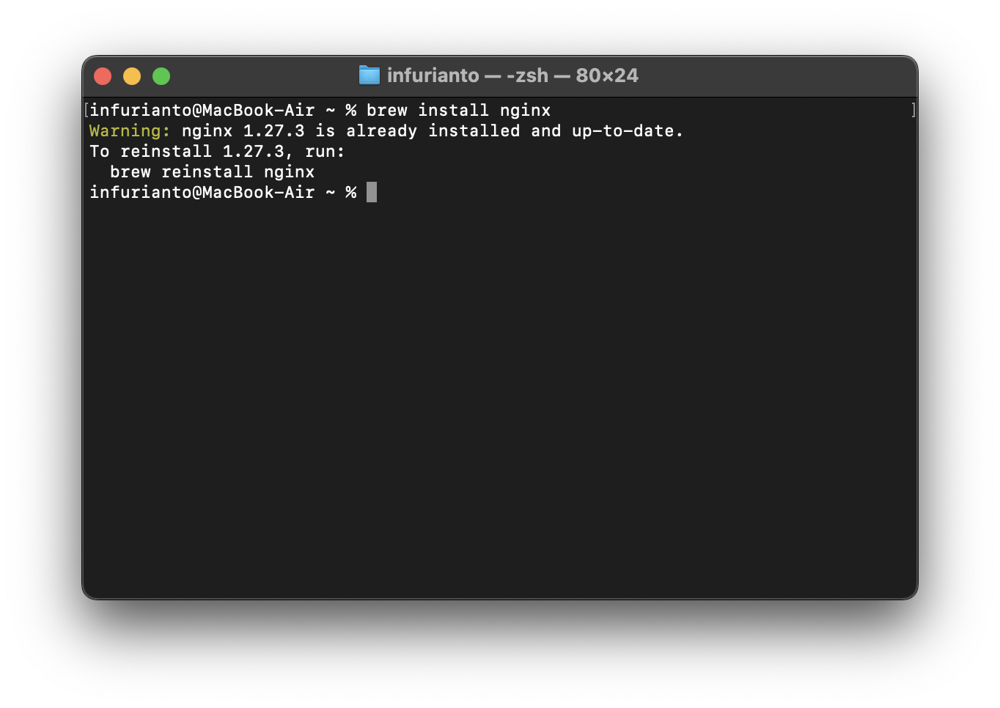
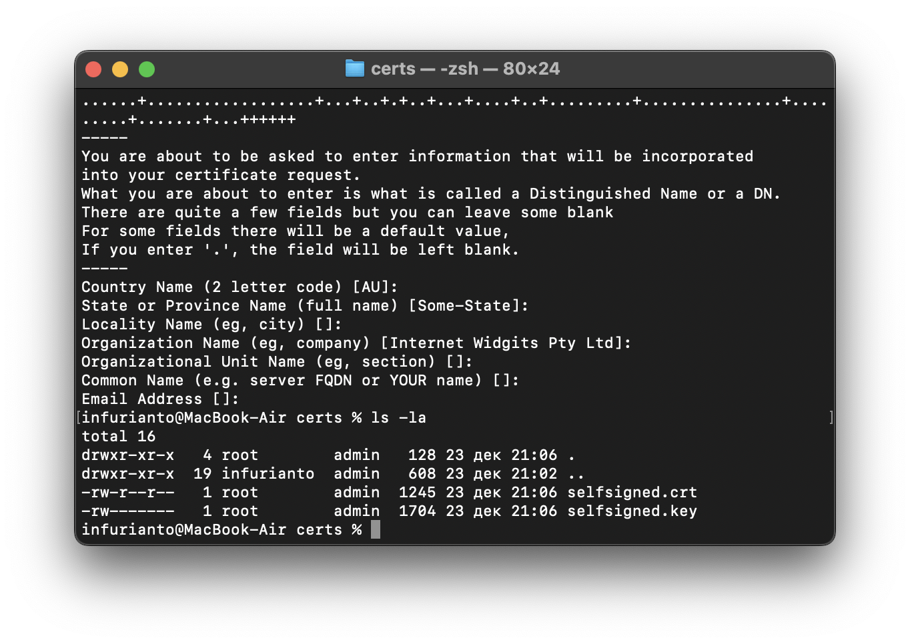
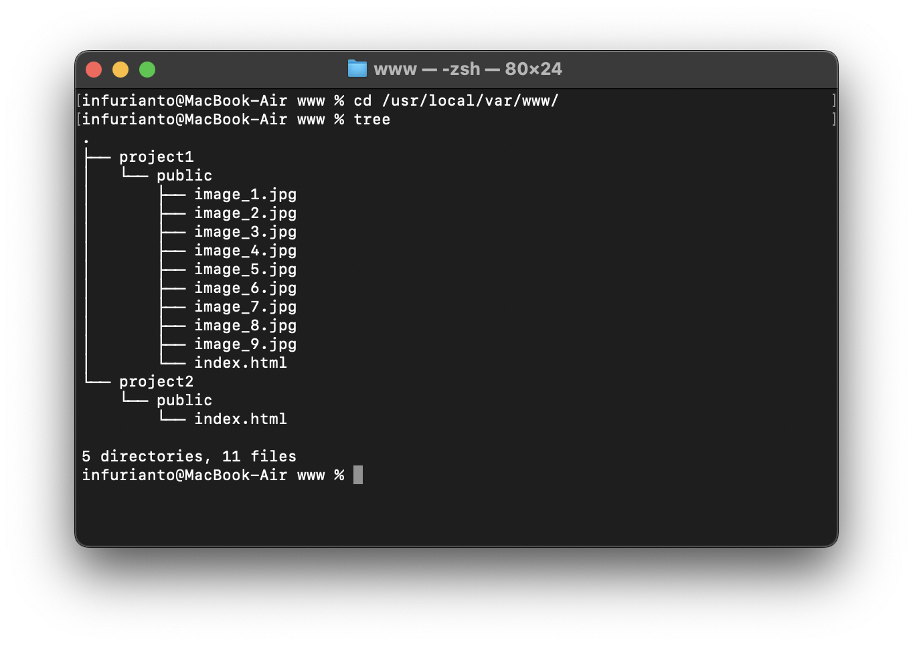
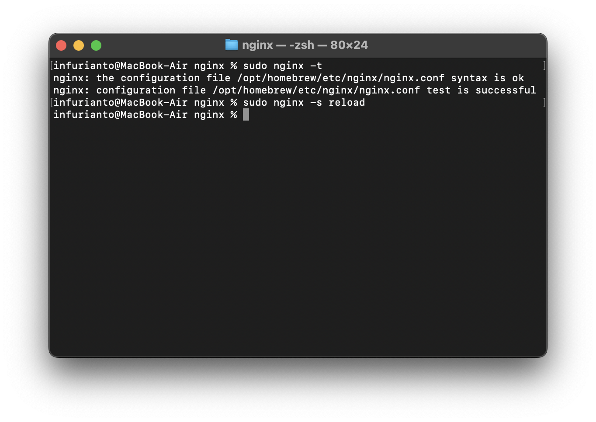

# Лабораторная работа 1

## Цель работы

1. Настроить веб-сервер Nginx на моем локальном компьютере с macOS.
2. Сгенерировать самоподписанный SSL-сертификат для обеспечения соединения через HTTPS.
3. Реализовать перенаправление HTTP-запросов (порт 80) на HTTPS (порт 443).
4. Настроить виртуальные хосты для обслуживания двух проектов на одном сервере.
5. Проверить корректность работы серверной конфигурации через веб-браузер.

## Ход выполнения работы

### 1. Установка и настройка Nginx

Для начала я установила Nginx и запустила с помощью команд:

```bash
brew install nginx
sudo nginx
```

также можем добавить Nginx в автозапуск с помощью утилиты `launchctl`:

```bash
sudo brew services start nginx
```



Убедившись, что установка завершилась успешно, перешла к следующему шагу.

### 2. Генерация самоподписанного SSL-сертификата

SSL-сертификат был создан следующими командами:

```bash
sudo mkdir /opt/homebrew/etc/nginx/certs
cd /opt/homebrew/etc/nginx/certs
sudo openssl req -x509 -nodes -days 365 -newkey rsa:2048 -keyout selfsigned.key -out selfsigned.crt
```

Оставляем пустые строки в запрашиваемых полях и создаем сертификат:



### 3. Создание проектов

Создадим пути для двух наших проектов.

```bash
sudo mkdir -p /usr/local/var/www/project1/public
sudo mkdir -p /usr/local/var/www/project2/public
```

Я создала два тестовых проекта:
1. HTML-страницу с галереей фото животных
2. HTML-страницу со списком научно-фантастических книг
и разместила их в созданных директориях



### 3. Настройка виртуальных хостов

Далее выполним настройку виртуальных хостов. Для этого я создала два конфигурационных файла для двух новых проектов и разместила их в `/opt/homebrew/etc/nginx/servers/`. Конфигурация nginx по умолчанию уже содержит команду `include servers/*`, поэтому обе дополнительные конфигурации будут учтены.

Конфигурация 1 `/opt/homebrew/etc/nginx/servers/project1.conf`:
```nginx
server {
    listen 80;
    server_name project1.infurianto.com;
    return 301 https://$host$request_uri;
}

server {
    listen 443 ssl;
    server_name project1.infurianto.com;

    ssl_certificate /opt/homebrew/etc/nginx/certs/selfsigned.crt;
    ssl_certificate_key /opt/homebrew/etc/nginx/certs/selfsigned.key;

    root /usr/local/var/www/project1;
    index index.html;

    location / {
        alias /usr/local/var/www/project1/public/;
        try_files $uri $uri/ =404;
    }
}
```

Конфигурация 2 `/opt/homebrew/etc/nginx/servers/project2.conf`:
```nginx
server {
    listen 80;
    server_name project2.infurianto.com;
    return 301 https://$host$request_uri;
}

server {
    listen 443 ssl;
    server_name project2.infurianto.com;

    ssl_certificate /opt/homebrew/etc/nginx/certs/selfsigned.crt;
    ssl_certificate_key /opt/homebrew/etc/nginx/certs/selfsigned.key;

    root /usr/local/var/www/project2;
    index index.html;

    location / {
        alias /usr/local/var/www/project2/public/;
        try_files $uri $uri/ =404;
    }
}
```

### 5. Проверка и перезапуск Nginx

Проверим корректность конфигурации:

```bash
sudo nginx -t
```

После того как убедилась, что ошибок в конфигурации нет, я перезапустила сервер:

```bash
sudo nginx -s reload
```



### 6. Настройка файла hosts для локального тестирования

Если мы перейдем по доменам проектов project1.infurianto.com, то такого сайта существовать не будет. Для локального тестирования я добавила эти записи в файл `/etc/hosts`:

```
127.0.0.1       project1.infurianto.com
127.0.0.1       project2.infurianto.com
```

Это позволило обращаться к проектам по заданным именам.

### 7. Тестирование работы проектов

Откроем браузер и проверим работу обоих проектов, перейдя по следующим ссылкам:

- https://project1.infurianto.com
- https://project2.infurianto.com


Т.к. мы заходим на сайт с самоподписанным SSL сертификатом, то при первом заходе видим предупреждение:


Чтобы получить полноценное доверие сертификату необходимо использовать сертификат, подписанный реальным центром сертификации, например, Let's Encrypt. Но для этого требуется публичный сервер с доменным именем, поэтому пока остановимся на добавлении самоподписанного сертификата в локальный список доверенных.

## Заключение

В результате работы сервер Nginx был успешно настроен для обслуживания двух проектов через HTTPS. Реализовано перенаправление с HTTP на HTTPS, использованы виртуальные хосты и псевдонимы путей. Оба проекта работают корректно и доступны локально по указанным доменам.

