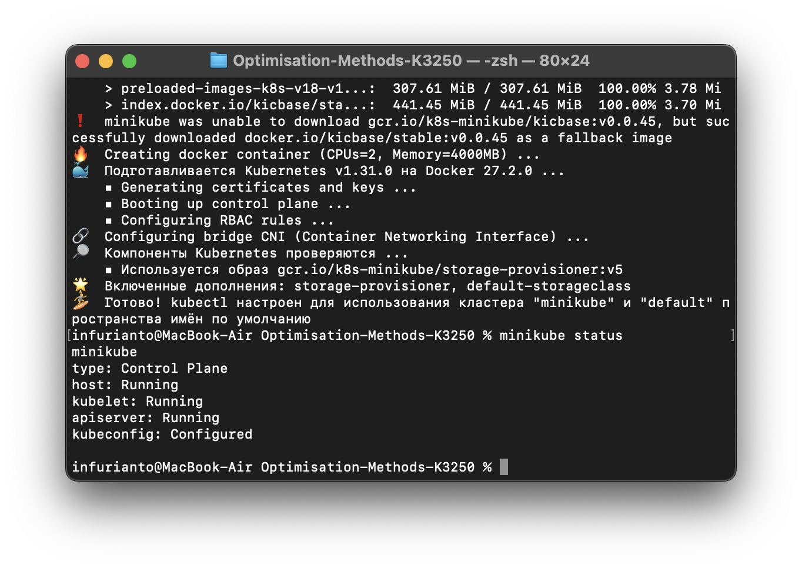
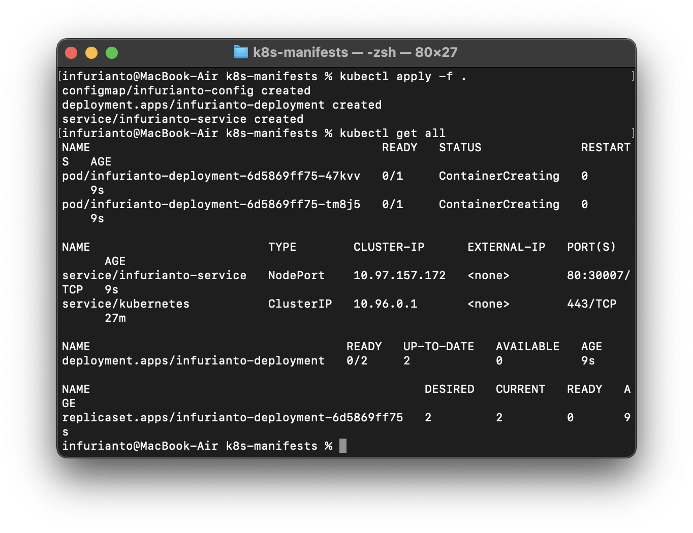
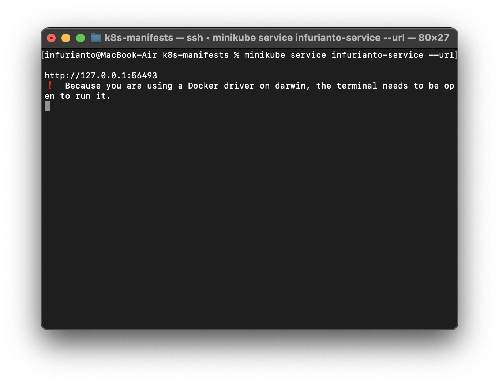
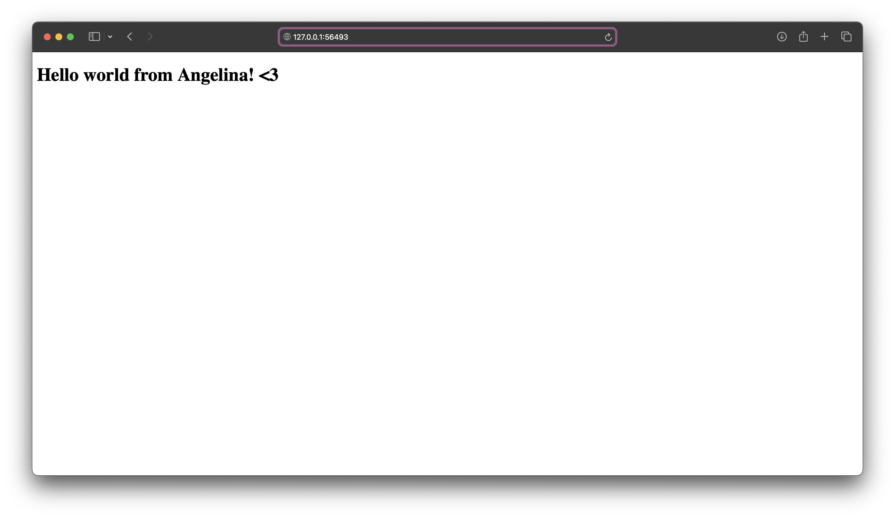

# Лабораторная работа 3

## Цель работы

1. Поднять локальный Kubernetes кластер (Minikube).
2. Создать YAML-манифесты для автоматического развёртывания.
3. Развернуть сервис, используя 2 ресурса Kubernetes.

---

## Ход выполнения

### 1. Установка и запуск Minikube

1. Установим Minikube через Homebrew:
   ```bash
   brew install minikube
   ```

2. Запустим Minikube с драйвером Docker:
   ```bash
   minikube start --driver=docker
   ```

3. Проверим статус кластера:
   ```bash
   minikube status
   ```



### 2. Подготовка YAML-манифестов

Создадим директорию для манифестов:
```bash
mkdir k8s-manifests
cd k8s-manifests
```

#### Deployment (развёртывание приложения)
Создадим файл `deployment.yaml`:
```yaml
apiVersion: apps/v1
kind: Deployment
metadata:
  name: infurianto-deployment
spec:
  replicas: 2
  selector:
    matchLabels:
      app: infurianto
  template:
    metadata:
      labels:
        app: infurianto
    spec:
      containers:
      - name: infurianto
        image: nginx:alpine
        ports:
        - containerPort: 80
        volumeMounts:
        - name: html-volume
          mountPath: /usr/share/nginx/html
      volumes:
      - name: html-volume
        configMap:
          name: html-config
```

#### Service (Публикация сервиса)
Создадим файл `service.yaml`:
```yaml
apiVersion: v1
kind: Service
metadata:
  name: infurianto-service
spec:
  type: NodePort
  selector:
    app: infurianto
  ports:
  - protocol: TCP
    port: 80
    targetPort: 80
    nodePort: 30007
```

#### ConfigMap (конфигурация для контента)
Создадим файл `configmap.yaml`:
```yaml
apiVersion: v1
kind: ConfigMap
metadata:
  name: html-config
  namespace: default
data:
  index.html: |
    <!DOCTYPE html>
    <html>
    <head>
        <title>Hello world from Angelina!</title>
    </head>
    <body>
        <h1>Hello world from Angelina!</h1>
    </body>
    </html>
```

### 3. Применение манифестов

Запустим сервис одной командой:
```bash
kubectl apply -f .
```

Проверим, что ресурсы созданы:
```bash
kubectl get all
```



### 4. Тестирование сервиса

1. Получим URL для доступа к сервису:
   ```bash
   minikube service infurianto-service --url
   ```



2. Откроем URL в браузере. Мы видим страницу с заголовком "Hello world from Angelina!".



---

## Заключение

В рамках работы был поднят локальный Kubernetes кластер с использованием Minikube. Созданы и применены YAML-манифесты для развёртывания приложения, публикации сервиса и настройки конфигурации. Работоспособность сервиса подтверждена через веб-браузер.
