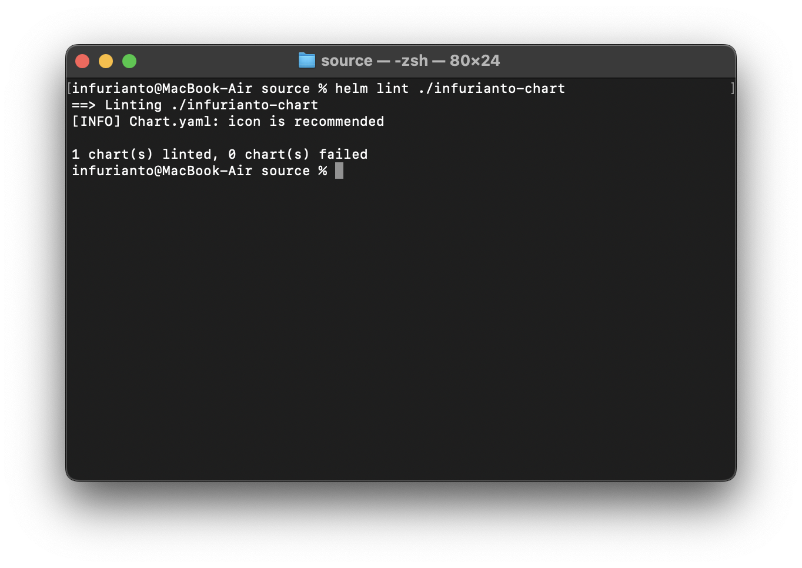

# Лабораторная работа 3*: Создание Helm Chart и управление сервисом

## Цель работы

1. Создать Helm Chart для сервиса из лабораторной работы 3.
2. Задеплоить Helm Chart в Kubernetes кластер.
3. Внести изменения в сервис и обновить релиз через Helm Upgrade.
4. Подготовить отчёт со скриншотами процесса, всеми файлами и описанием удобства использования Helm.

---

## Ход выполнения

### 1. Создание Helm Chart

1. **Инициализация Helm Chart:**
  Создадим новый Helm Chart:
  ```bash
  helm create infurianto-chart
  ```
  Это создаст базовую структуру Helm Chart в папке `infurianto-chart`.

  

2. **Обновление файлов Chart:**
  В файле `Chart.yaml` укажем основную информацию о проекте:
  ```yaml
  apiVersion: v2
  name: infurianto-chart
  description: A Helm chart for Kubernetes Hello World service
  version: 1.0.0
  ```

3. **Настройка Deployment:**
  Обновим файл `templates/deployment.yaml` для нашего сервиса:
  ```yaml
  apiVersion: apps/v1
  kind: Deployment
  metadata:
    name: {{ .Values.deployment.name }}
  spec:
    replicas: {{ .Values.deployment.replicas }}
    selector:
      matchLabels:
        app: {{ .Values.app.name }}
    template:
      metadata:
        labels:
          app: {{ .Values.app.name }}
      spec:
        containers:
        - name: infurianto
          image: {{ .Values.image.repository }}:{{ .Values.image.tag }}
          ports:
          - containerPort: 80
          volumeMounts:
          - name: html-volume
            mountPath: /usr/share/nginx/html
        volumes:
        - name: html-volume
          configMap:
            name: {{ .Values.configMap.name }}
  ```

4. **Настройка Service:**
  Обновим файл `templates/service.yaml`:
  ```yaml
  apiVersion: v1
  kind: Service
  metadata:
    name: {{ .Values.service.name }}
  spec:
    type: NodePort
    selector:
      app: {{ .Values.app.name }}
    ports:
    - protocol: TCP
      port: 80
      targetPort: 80
      nodePort: {{ .Values.service.nodePort }}
  ```

5. **Настройка ConfigMap:**
  Добавим файл `templates/configmap.yaml`:
  ```yaml
  apiVersion: v1
  kind: ConfigMap
  metadata:
    name: {{ .Values.configMap.name }}
  data:
    index.html: |
      <!DOCTYPE html>
      <html>
      <head>
          <title>Hello world from Angelina!</title>
      </head>
      <body>
          <h1>Hello world from Angelina! <span style="color:red;">Revision 1</span></h1>
      </body>
      </html>
  ```

6. **Обновление файла значений `values.yaml`:**
  ```yaml
  app:
    name: infurianto

  deployment:
    name: infurianto-deployment
    replicas: 2

  service:
    name: infurianto-service
    nodePort: 30008

  image:
    repository: nginx
    tag: alpine

  configMap:
    name: html-config
  ```

7. **Удалим лишние файлы из директории `templates`**

  

8. **Проверим Chart на корректность**
  ```bash
  helm lint ./infurianto-chart
  ```

  

### 2. Деплой Helm Chart

1. **Установим Helm Chart в кластер:**
  ```bash
  helm install infurianto ./infurianto-chart --namespace infurianto --create-namespace
  ```

  

2. **Проверим, что ресурсы созданы:**
  ```bash
  kubectl get all -n infurianto
  ```

3. **Получим URL для доступа к сервису:**
  ```bash
  minikube service infurianto-service -n infurianto --url
  ```

  

4. **Откроем URL в браузере, чтобы убедиться в работоспособности сервиса.**

  

### 3. Обновление Helm Chart

1. **Изменим HTML-контент в `values.yaml`:**
  Обновим поле `index.html` в `templates/configmap.yaml`, например, добавив "Updated by Helm":
  ```html
  <h1>Hello world from Angelina! <span style="color:blue;">Revision 2</span></h1>
  ```

2. **Обновим релиз с помощью команды `helm upgrade`:**
  ```bash
  helm upgrade infurianto ./infurianto-chart -n infurianto
  ```

3. **Проверим обновление:**
  - Выполним `kubectl get pods -n infurianto`.
  - Перейдём по URL, чтобы увидеть обновлённый контент.

### 4. Скриншоты

Приложите скриншоты следующих шагов:
1. Создание Helm Chart.
2. Деплой сервиса.
3. Доступ к сервису через браузер.
4. Обновление контента через Helm Upgrade.

---

## Преимущества использования Helm

1. **Повторяемость:**
   - Упакованные чартами манифесты легко переиспользовать на других кластерах.

2. **Обновления и откаты:**
   - Простое обновление приложения и возможность откатиться к предыдущей версии с помощью `helm rollback`.

3. **Параметризация:**
   - Использование переменных в `values.yaml` позволяет изменять конфигурации без редактирования файлов манифестов.

---

## Заключение

Helm Chart был успешно создан на основе YAML-манифестов из Лабораторной работы 3. Сервис был задеплоен в Kubernetes, после чего была произведена успешная модификация и обновление с помощью Helm. Данный подход продемонстрировал удобство управления и повторяемость деплоя.

