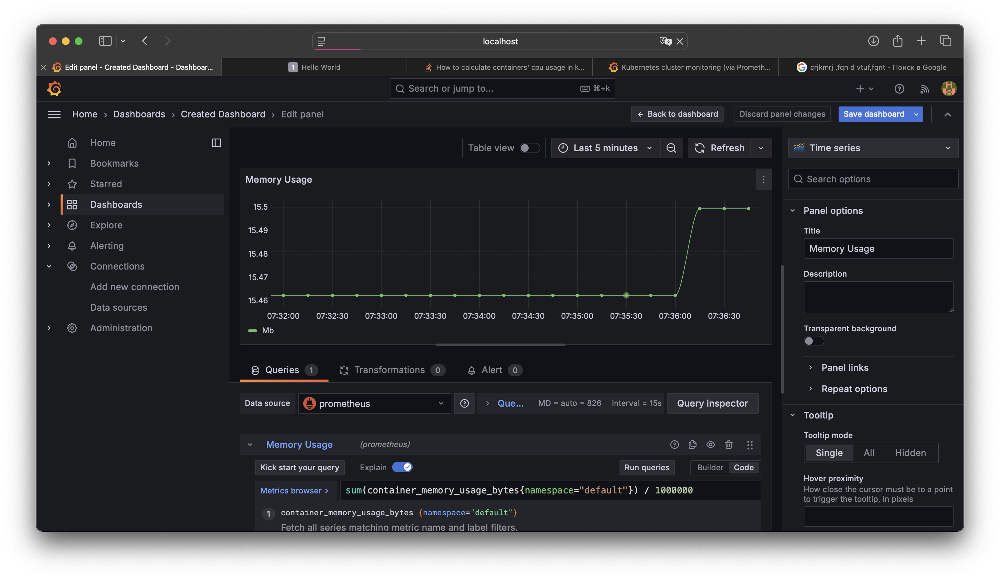

# Лабораторная работа 5

## Цель работы

1. Настроить мониторинг для сервиса, запущенного в Kubernetes, используя Prometheus и Grafana.
2. Показать как минимум два графика, отражающих состояние системы.
3. Приложить скриншоты всего процесса настройки.

---

## Ход выполнения

### 1. Установка Prometheus и Grafana

Для установки Prometheus и Grafana используем Helm.

1. **Установим Helm:**

   ```bash
   brew install helm
   ```

2. **Добавим репозиторий Helm для Prometheus и Grafana:**

   ```bash
   helm repo add prometheus-community https://prometheus-community.github.io/helm-charts
   helm repo add grafana https://grafana.github.io/helm-charts
   helm repo update
   ```

   

4. **Установим Prometheus и Grafana:**

   ```bash
   helm install prometheus-operator prometheus-community/kube-prometheus-stack --namespace monitoring --create-namespace
   ```
   Этот чарт уже включает Prometheus, Grafana вместе c некоторыми другими компонентами.

5. **Проверим, что сервисы запущены:**

   ```bash
   kubectl get pods -n monitoring
   ```

   

### 2. Настройка Prometheus для сбора метрик

**Создадим ServiceMonitor для нашего сервиса:**
Создадим файл `service-monitor.yaml`:

```yaml
apiVersion: monitoring.coreos.com/v1
kind: ServiceMonitor
metadata:
  name: infurianto-monitor
  namespace: monitoring
spec:
  selector:
    matchLabels:
      app: infurianto
  endpoints:
  - port: http
    path: /metrics
    interval: 15s
```

Применим манифест:

```bash
kubectl apply -f service-monitor.yaml
```


### 3. Настройка Grafana

1. **Получим пароль администратора Grafana:**

   ```bash
   kubectl get secret --namespace monitoring grafana -o jsonpath="{.data.admin-password}" | base64 --decode ; echo
   ```

2. **Откроем порт для доступа к Grafana:**

   ```bash
   kubectl port-forward svc/grafana 3000:80 -n monitoring
   ```

   Теперь Grafana доступна по адресу [http://localhost:3000](http://localhost:3000).

   

3. **Настроим источник данных:**

   - Войдем в Grafana с именем пользователя `admin` и полученным паролем.
   - Перейдем в **Connections > Data Sources**.
   - Добавим новый источник данных Prometheus с URL `http://prometheus-server.monitoring.svc.cluster.local`.

   

### 4. Примеры метрик и графиков

#### Сформируем свой дашборд для слежения за использованием памяти и CPU:
- Перейдем в **Create > Dashboard > Add new panel**.
- Настроим панели с нужными метриками:
   1. **CPU Usage:**
      Запрос в PromQL:

      ```promql
      sum(rate(container_cpu_usage_seconds_total{namespace="default"}[5m]))
      ```

      График покажет среднюю загрузку CPU в кластере.

      

   2. **Memory Usage:**
      Запрос в PromQL:

      ```promql
      sum(container_memory_usage_bytes{namespace="default"}) / 1000000
      ```

      График покажет использование памяти в Mb.

      

- Созданный дашборд выглядит следующим образом:

   

#### Второй дашборд импортируем из Grafana.com по id (315).


---

## Заключение

В рамках работы был настроен мониторинг для сервиса, запущенного в Kubernetes. Использовались Prometheus для сбора метрик и Grafana для их визуализации. Были настроены два графика, показывающие загрузку CPU и использование памяти. Также был опробован импортированный из grafana.com уже готовый дашборд. Работоспособность решений подтверждена.
